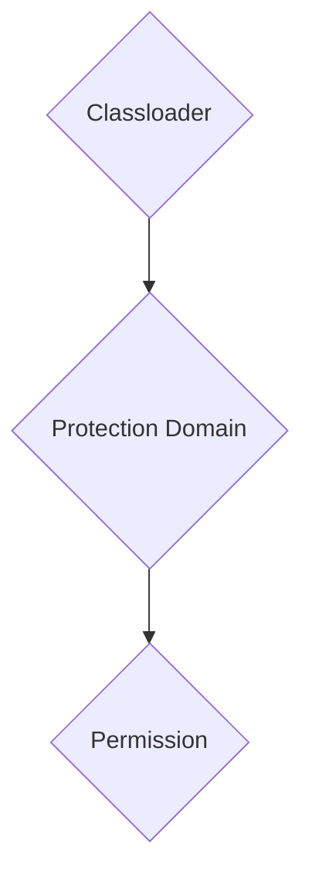

The objective of this project was to see how I could put safeguards
with [java.lang.SecurityManager](https://docs.oracle.com/en/java/javase/17/docs/api/java.base/java/lang/SecurityManager.html), [java.security.Policy](https://docs.oracle.com/en/java/javase/17/docs/api/java.base/java/security/Policy.html),
and [java.security.Permission](https://docs.oracle.com/en/java/javase/17/docs/api/java.base/java/security/Permission.html).
**It was hard**.

I am aware that all these classes are deprecated for removal, but I wanted to experience it myself the reasons for which
these classes are being removed.

> Classloader contains protection domain contains permission

### Problems

1. To attach permissions to classfiles, we need to load classes with a classloader that sets permission. I used
   reflection with my custom classloader that would then load log4j classes. **I had to load at least one class using
   reflection so that I could register the permissions.**
   > One can also do without and filter based on the callstack, but I am not sure how to register it to e
2. If I
   set [AllPermissions](https://docs.oracle.com/en/java/javase/17/docs/api/java.base/java/security/AllPermission.html)
   in the protection domain of class loader, the vulnerability would execute. However, if I individually added all
   permissions declared by Permission class, the vulnerability would stop executing. **It is not clear which permission
   blocks** JNDI lookup (`log4shell`).
